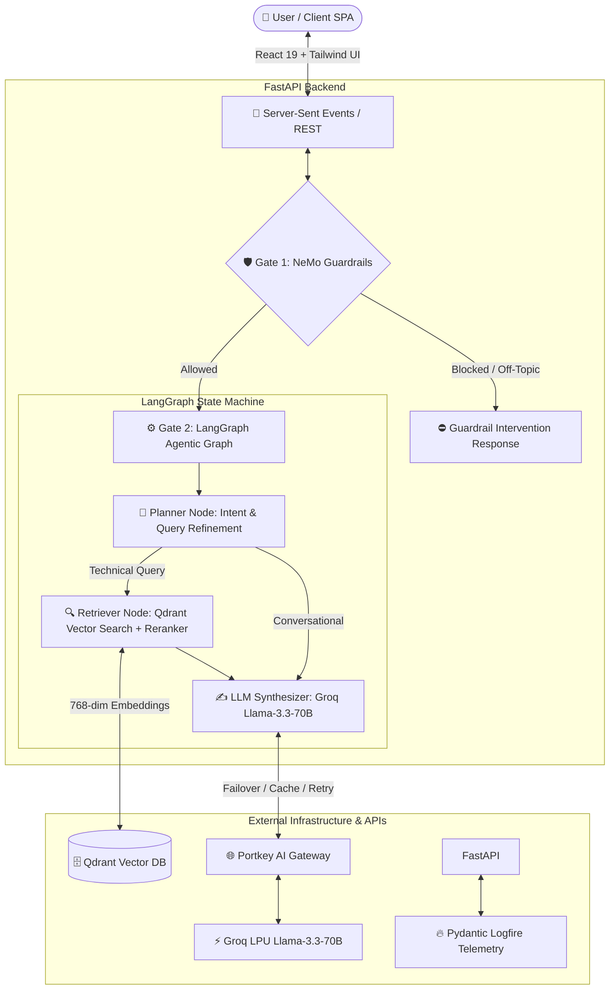

# Enterprise Agentic RAG Assistant for Kubernetes 🚀

[](https://enterprise-rag-app-pi.vercel.app/)
[](https://fastapi.tiangolo.com/)
[](https://react.dev/)
[](https://tailwindcss.com/)
[](https://www.langchain.com/langgraph)
[](https://github.com/NVIDIA/NeMo-Guardrails)
[](https://qdrant.tech/)
[](https://groq.com/)
[](https://pydantic.dev/logfire)

🌐 **Live Application Demo**: [https://enterprise-rag-app-pi.vercel.app/](https://enterprise-rag-app-pi.vercel.app/)

A production-grade, enterprise-ready **Agentic Retrieval-Augmented Generation (RAG)** application engineered specifically for **Kubernetes Infrastructure**, **Cloud-Native Architecture**, and **Enterprise IT Operations**. 

This application bridges the gap between raw enterprise documentation and intelligent automation by integrating **LangGraph multi-step reasoning state machines**, **NVIDIA NeMo Guardrails**, **Qdrant hybrid vector search**, **Groq Llama-3.3-70B LPU inference**, **Portkey AI gateway resiliency**, and an **animated React 19 + Tailwind CSS v4 streaming dashboard**.

---

## 🌐 Live Production Deployment

- 🚀 **Live Interactive Demo**: [https://enterprise-rag-app-pi.vercel.app/](https://enterprise-rag-app-pi.vercel.app/)
- ⚙️ **Backend REST & SSE API**: Hosted on **Render** (FastAPI + Server-Sent Events real-time streaming).
- 🗄️ **Managed Vector DB**: Hosted on **Qdrant Cloud** (768-dim Gemini embeddings + Cosine similarity).
- 🛠️ **Deployment Blueprints**: Complete step-by-step guides for Docker Compose, Kubernetes, and Cloud PaaS are available in [DEPLOYMENT.md](DEPLOYMENT.md).

---

## 🌟 Key Architecture & Highlights

### 🤖 1. Multi-Stage LangGraph Agentic State Machine
Unlike simple single-prompt RAG chains, this system uses a **cyclic LangGraph state machine**:
- **Planner Node**: Evaluates user query context and intent against conversation memory to decide whether technical document search is required or if it can be answered conversationally.
- **Retriever Node**: Queries Qdrant vector database using Google Gemini 768-dim embeddings and applies semantic reranking (top-N selection) to filter noise.
- **Synthesizer Node**: Combines retrieved technical context, conversation history, and user intent to generate accurate, verified, grounded technical responses using Groq Llama-3.3-70B.

### 🛡️ 2. Dual-Layer Defensive Security (NVIDIA NeMo + Colang 2.0)
Security and compliance are built directly into Gate 1 of the architecture:
- **Prompt Injection & Jailbreak Defense**: Intercepts instructions attempting to override system prompts or bypass safety boundaries.
- **Off-Topic & Out-of-Scope Filtering**: Restricts responses to verified enterprise IT domain boundaries (Kubernetes, Intel hardware, enterprise networking).
- **Fail-Closed Async Engine**: Native `guard_async` integration ensuring non-blocking evaluation under heavy streaming loads.

### 📡 3. Real-Time Token Streaming (Server-Sent Events)
- High-performance `POST /query/stream` endpoint pushing tokens in real-time over **SSE (Server-Sent Events)**.
- Transmits live execution metadata: reasoning steps timeline (`thought_process`), retrieved source chunks, guardrail status badges, and token streams with custom typing cursor animations (`▌`).

### 📁 4. Universal Ingestion & Vector Pipeline
- Supports real-time drag-and-drop document upload (**PDF**, **TXT**, **HTML**, **DOCX**).
- Implements recursive character text chunking and indexing directly into **Qdrant Vector Cluster** using **Gemini Embeddings**.
- Supports dataset categorization: Ground Truth (`true_data`), Noisy Benchmark (`noisy_data`), and General Documentation (`general`).

### 📊 5. End-to-End Observability & Tracing
- Fully instrumented with **Pydantic Logfire** (OpenTelemetry standard).
- Captures distributed spans across NeMo safety checks, Qdrant vector retrieval latencies, Cohere reranking, and Groq LLM generations.

---

## 🏗️ System Architecture



---

## 🛠️ Technology Stack

| Layer | Technology | Purpose & Highlights |
| :--- | :--- | :--- |
| **Frontend Framework** | **React 19 + Vite 8** | Modern Component Architecture, Fast HMR, SSE Stream Reader |
| **Styling & UI** | **Tailwind CSS v4 + Framer Motion** | Glassmorphism Theme, Micro-animations, Dark Canvas, Lucide Icons |
| **Backend Framework** | **FastAPI + Uvicorn** | Asynchronous REST & SSE Streaming Architecture, CORS Middleware |
| **Agentic Framework** | **LangGraph + LangChain** | StateGraph Machine, Memory Checkpointer, Multi-node Routing |
| **Safety & Guardrails** | **NVIDIA NeMo Guardrails 2.0** | Colang Policy Rules, Jailbreak & Off-Topic Interception |
| **Vector Database** | **Qdrant Cloud / Local** | High-performance Cosine Similarity Vector Indexing |
| **Embeddings** | **Google Gemini Embeddings** | 768-dimensional Semantic Vector Representations |
| **LLM Inference** | **Groq Llama-3.3-70B Versatile** | Ultra-fast LPU Hardware Inference |
| **LLM Gateway** | **Portkey AI Gateway** | Production Resiliency, Retries, Fallbacks, Semantic Caching |
| **Observability** | **Pydantic Logfire** | OpenTelemetry-compliant Distributed Tracing & Span Monitoring |

---

## 🚀 Getting Started

### Prerequisites
- **Python**: `^3.10`
- **Node.js**: `^18.0.0`
- **API Keys**: Groq, Gemini, Qdrant Cluster Endpoint & API Key, Logfire Token (Optional)

---

### 1. Backend Setup

```bash
# Navigate to backend directory
cd backend

# Create & activate virtual environment
python -m venv .venv
# Windows:
.venv\Scripts\activate
# Linux/macOS:
source .venv/bin/activate

# Install dependencies
pip install -r requirements.txt

# Configure environment variables (.env)
cp .env.example .env
```

#### Sample `.env` Configuration:
```env
GROQ_API_KEY="your_groq_api_key"
GEMINI_API_KEY="your_gemini_api_key"
QDRANT_CLUSTER_ENDPOINT="https://your-qdrant-cluster.qdrant.tech"
QDRANT_API_KEY="your_qdrant_api_key"
LOGFIRE_TOKEN="your_logfire_token"
PORTKEY_API_KEY="your_portkey_api_key"
PORTKEY_GATEWAY_CONFIG="pc-groq-..."
```

#### Run FastAPI Server:
```bash
uvicorn app.main:app --reload --port 8000
```
Backend will be live at `http://localhost:8000` with interactive OpenAPI docs at `http://localhost:8000/docs`.

---

### 2. Frontend Setup

```bash
# Open a new terminal and navigate to frontend directory
cd frontend

# Install Node dependencies
npm install

# Start Vite dev server
npm run dev
```
Frontend will be live at **`http://localhost:5173`**.

---

## 🔌 API Endpoints Summary

| Endpoint | Method | Description |
| :--- | :--- | :--- |
| `POST /query/stream` | `POST` | **Server-Sent Events (SSE)** real-time token streaming with reasoning steps & source chunks. |
| `POST /query` | `POST` | Synchronous RAG query endpoint returning full JSON payload. |
| `POST /upload` | `POST` | Upload document file (PDF, TXT, HTML, DOCX), parse, chunk, embed, and index into Qdrant. |
| `GET /documents` | `GET` | Retrieve list of all processed document metadata and chunk snippets. |
| `GET /stats` | `GET` | Fetch live Qdrant collection vector count, dimensions, and distance metrics. |
| `GET /guardrails` | `GET` | Inspect active NVIDIA NeMo Guardrail status and sample Colang policy rules. |
| `GET /graph` | `GET` | Serves real-time Mermaid PNG image of the LangGraph agent state machine. |
| `GET /health` | `GET` | Real-time diagnostic check for Qdrant, Groq, Gemini, and Logfire services. |
| `DELETE /memory/{thread_id}` | `DELETE` | Clear conversation history checkpointer for a given session. |

---

## 🖥️ UI Dashboard Features

1. 💬 **RAG Assistant & Chat Playground**: Interactive conversation UI with step-by-step reasoning timeline, guardrail warning badges, formatted Markdown output, code copy triggers, and expandable source chunk cards.
2. 📁 **Knowledge Base & Universal Ingestion**: Drag-and-drop dropzone, live chunking/embedding status tracker, and dataset explorer.
3. 🕸️ **LangGraph Agent Workflow Visualizer**: Mermaid state diagram render & step-by-step node breakdown (`Planner -> Retriever -> Synthesizer`).
4. 🛡️ **NeMo Guardrails & Security Hub**: Interactive test simulator for evaluating prompt injection defenses and Colang rule previews.
5. 📊 **Vector Analytics & Observability**: Real-time Qdrant cluster statistics and Logfire distributed tracing information.
6. ⚙️ **System Configuration**: Infrastructure matrix showing active models, gateways, and environment setup checks.

---

## 💼 Key Engineering Takeaways for Technical Recruiters

- **Enterprise Security First**: Built with fail-closed NVIDIA NeMo Guardrails preventing prompt injection and data leaks.
- **Production Performance**: Uses SSE streaming, asynchronous Python handlers (`guard_async`), and Groq LPU hardware acceleration to maintain sub-second time-to-first-token.
- **Clean Architecture & Maintainability**: Modular separation between API Gateway, Agent Nodes, Vector Retrieval Services, and UI Components.
- **Resilient AI Pipelines**: Integrated Portkey gateway with fallbacks, retries, and semantic caching to prevent API downtime.

---

## 📄 License
Distributed under the MIT License. See `LICENSE` for more information.
